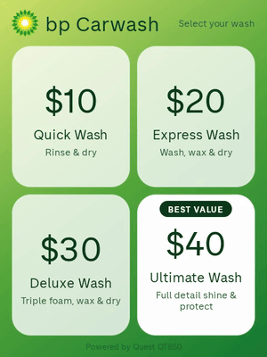
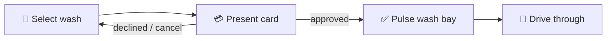

<div align="center">

# BP Carwash · Quest QT850

**Tap a wash. Tap your card. Drive through.**

A premium BP-branded carwash retail app for the
[Quest QT850 smart payment terminal](https://www.questpaymentsystems.com/qt850-smart-payment-terminal.html) —
a four-button unattended kiosk that sells, charges, and unlocks the wash in
one flow.

[](https://github.com/simoncrean/upgraded-goggles/actions/workflows/ci.yml)




*Recorded on the `qt850` emulator at the terminal's native 480×640.
Higher quality: [demo.mp4](docs/demo.mp4)*

</div>

---

## The product

| Wash | Price | Includes |
|------|:-----:|----------|
| Quick Wash | **$10** | Rinse & dry |
| Express Wash | **$20** | Wash, wax & dry |
| Deluxe Wash | **$30** | Triple foam, wax & dry |
| Ultimate Wash ⭐ *Best value* | **$40** | Full detail shine & protect |

One screen, four big buttons, zero training. When payment approves, the app
pulses the wash-bay controller and the customer drives through — no codes to
type, no receipt to keep.



Built kiosk-first: portrait-locked, fullscreen, screen always on, back
button swallowed, `lockTaskMode` for MDM pinning, and registered as HOME so
a device policy can make it the terminal's launcher. Every idle path times
out back to the menu — walk-aways never strand the next customer.

## Designed for the hardware

The QT850 is a payment terminal, not a phone
([spec sheet v10](https://www.questpaymentsystems.com/assets/quest---qt850-payment-terminal---spec-sheet-v10.pdf)):

| Constraint | Decision |
|------------|----------|
| Android 9.0 (Pie) | `minSdk 28` |
| 3.5″ IPS, 480×640 portrait | UI hand-sized for ~320×427dp, ≥52dp touch targets |
| 1 GB RAM, 8 GB flash | Plain Views + Kotlin, no Compose — 2.3 MB release APK |
| EMV / NFC / MSR via Quest's payment app | Payments behind a provider abstraction (below) |

## Architecture

```
app/src/main/java/com/bp/carwash/
├── MainActivity.kt          # single-activity kiosk UI: menu → processing → result
├── WashBayController.kt     # coin-pulse wash unlock (emulates a coin acceptor)
├── catalog/
│   ├── ProductCatalog.kt    # data model: Product + catalogue validation
│   └── CatalogSource.kt     # bundled JSON today, catalogue API later
└── payment/
    ├── PaymentProvider.kt   # suspend fun purchase(amountCents, ref): PaymentResult
    ├── PaymentGateway.kt    # provider selection — the single swap point
    ├── SimulatedPaymentProvider.kt   # active: approves in 2.5s, runs anywhere
    └── QuestPaymentProvider.kt       # fail-fast stub until Quest onboarding
```

**Products are data, not code.** The menu renders from a catalogue document
(`assets/catalog.json`) — the exact shape a future catalogue API will
serve:

```json
{
  "schemaVersion": 1,
  "currency": "AUD",
  "updatedAt": "2026-08-12T00:00:00Z",
  "products": [
    { "id": "deluxe", "name": "Deluxe Wash", "description": "Triple foam, wax & dry",
      "priceCents": 3000, "displayOrder": 3 },
    { "id": "ultimate", "name": "Ultimate Wash", "description": "Full detail shine & protect",
      "priceCents": 4000, "displayOrder": 4, "featured": true }
  ]
}
```

Money is integer cents; parsing ignores unknown keys so newer API fields
never break deployed terminals; validation rejects catalogues the menu
can't render (empty, >4 products, duplicate ids, non-positive prices, more
than one featured). `CatalogSource` mirrors the payment pattern —
`BundledCatalogSource` is active (terminals must sell offline), and
`ApiCatalogSource` is a fail-fast stub until the API contract is defined
(expected: `GET /catalog` returning this document; fetch-then-cache with
bundled fallback).

**Payments.** The QT850's card readers are driven by Quest's own payment
application; custom apps hand over the sale amount and receive the result
(on-terminal intent contract or Quest's Cloud EFTPOS API). That requires
merchant onboarding — integration pack, fleet registration, MAM-signed
deployment (Quest: +61 3 8807 4400 / info@questpaymentsystems.com). Until
then the simulated provider exercises the entire retail flow on any device,
and the Quest stub throws rather than pretend — it can never be swapped in
half-configured and silently drop sales. The swap point is one line:
`PaymentGateway.provider`.

**Wash unlock — coin-pulse.** On approval the app emulates a coin acceptor,
the electrical convention carwash entry controllers (Dixmor, GinSan,
Hamilton and similar) already understand: a dry-contact / open-collector
line into the controller's **coin input**, pulsed once per coin-value of
credit — a $30 wash at the default $1/pulse is a 30-pulse train, 100 ms
closed / 100 ms open per pulse. Coin value and pulse timing are
site-configurable via `CoinPulseConfig`; the physical line is behind the
one-method `PulseOutput` interface (wire it to the QT850's RS232 port
driving a relay module, or a network I/O module at the bay). No controller
reprogramming needed — the bay credits pulses exactly as it would coins.

## Quick start

```sh
cp local.properties.example local.properties   # point sdk.dir at your SDK
./gradlew assembleDebug                        # → app/build/outputs/apk/debug/
adb install -r app/build/outputs/apk/debug/app-debug.apk
```

JDK 17 + Android SDK (platform 34). Runs on any Android 9+ device or
emulator — the simulated provider approves every sale so the full flow is
demoable out of the box.

## Tests

CI gates every push and PR on the fast layer; the Espresso suite runs
against the QT850-sized emulator (setup in
[CONTRIBUTING.md](CONTRIBUTING.md)). Reports land in `app/build/reports/`.

```sh
./gradlew testDebugUnitTest lintDebug                              # fast — CI gate
ANDROID_SERIAL=emulator-5554 ./gradlew connectedDebugAndroidTest   # full GUI suite
```

| Suite | Covers |
|-------|--------|
| `CatalogTest` | Pins the bundled catalogue (ids, $10/$20/$30/$40, single featured) and the wire format: unknown-key tolerance, price labels, validation rejections |
| `WashBayControllerTest` | Coin-pulse electrical contract: one pulse per dollar (per tier), configurable coin value, closed/open alternation ending open, train duration, indivisible coin values rejected |
| `SimulatedPaymentProviderTest` · `QuestPaymentProviderTest` | Provider contracts; the Quest stub must fail fast |
| `MenuScreenTest` · `ComponentTest` | Every screen's components: header brand, tier cards, best-value badge, processing elements, result states |
| `PurchaseFlowTest` | End to end with injected fakes: right amount charged, pulse on approval **only**, decline keeps the wash locked, cancel and double-tap safety |

## Deploying to the terminal

1. **Development** — enable ADB in the Quest supervisor menu on a
   developer-unlocked unit, then `adb connect <terminal-ip>` and
   `adb install -r app-debug.apk`.
2. **Production** — QT850 fleets are PCI PTS devices: APKs are submitted to
   Quest for signing and pushed fleet-wide via Quest's mobile app management
   (MAM). Release builds stay debug-signed until that pipeline is issued.

## Status

- ✅ Retail flow, kiosk hardening, BP branding, unit + Espresso suites, CI
- 🔌 Awaiting Quest integration pack → implement `QuestPaymentProvider`
- 🔌 Awaiting site hardware spec → implement `PulseOutput` (relay/opto line to the coin input)
- ⚠️ BP Helios branding requires franchise brand approval before rollout

## Contributing

Branch from `main`, keep money maths under test, run the checks, open a PR —
project layout, emulator setup, and conventions in
[CONTRIBUTING.md](CONTRIBUTING.md).
